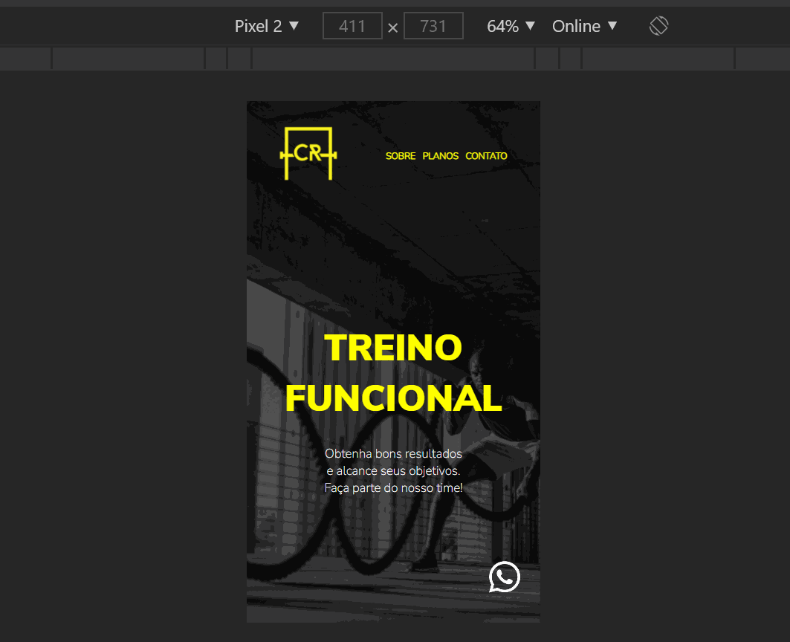

# CrFuncional

### - Após terminar o módulo de Flex Box, decidi que eu precisava colocar em prática tudo que aprendi sobre o tema, então percebi que a academia onde eu treino não tinha site e com isso surgiu a ideia de desenvolver este projeto.

### - Quando finalizei o projeto mostrei para o dono da academia e ele gostou bastante da ideia, pois isso abriria a oportunidade dele alcançar novos clientes pelo buscador do Google. Até o momento ele só tinha Instagram e impulsionava anúncios apenas por lá. 

#### * Este projeto pode ser minha primeira venda como freela ;D (torçam por mim).

### - Nesta aplicação foram usados as seguintes tecnologias:

#### *HTML.
#### *CSS.
#### *JavaScript

### Front End para desktop (responsível para monitores até 1920 px)

### Front End para celular

### Veja o projeto você mesmo! Acesse: https://crfuncional.netlify.app

### Gostou do meu projeto? :D Entre em contato comigo! 
[Linkedin](https://www.linkedin.com/in/lucas-rosa-058683102/)  
[Email: lucasmetron@gmail.com](mailto:lucasmetron@gmail.com)
